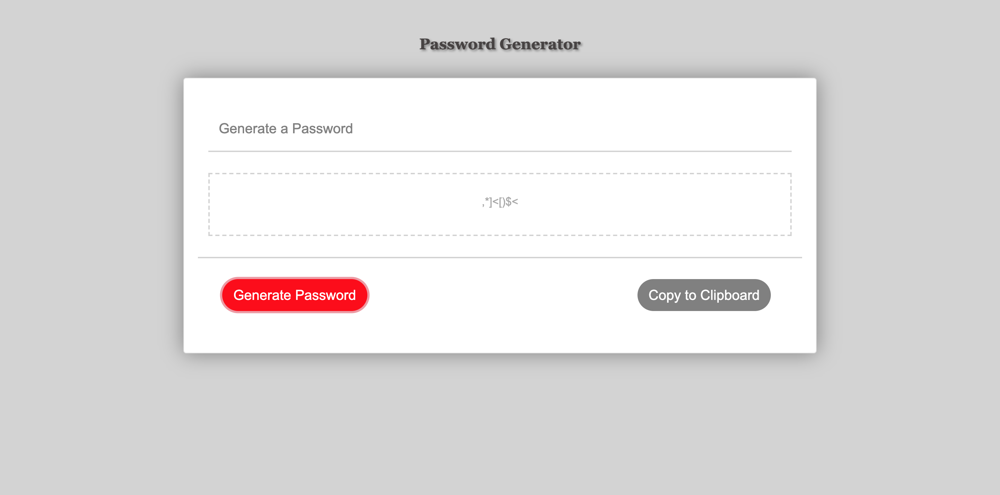

# Homework-3
Project name: Password Generator!

Description: This is a basic website I developed for practice and homework using bootstrap. It is a relatively simple script that generates a password between 8 and 128 characters from various character lists of your choosing. It also features a sticky footer, bootstrap content, and CSS Styling.

Usage: Follow the prompts. Be sure to select at least 1 of the 4 character types and a password length between 8 and 128. Once complete,hit the generate password button to see your password. If you desire, there is a button to copy it to your clipboard. 

Contributing: University of Richmond Full Stack Deveolpment Bootcamp

Credits: Lawrence Snead, the one and only!

License: ...