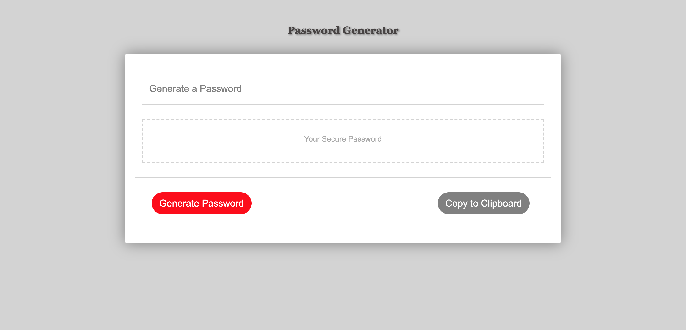

## Password Generator
## User Story

Aa an employee with access to sensitive data

I want to randomly generate a password that meets certain criteria

So that I can create a strong password that provides greater security

## Business Context

For companies that handle large amounts of sensitive data, weak passwords can pose a real security threat. An application that can generate strong passwords quickly and effortlessly saves employees time and ensures secure access to data.

## Acceptance Criteria

GIVEN that a user needs a new, secure password

WHEN prompted for password criteria

THEN a password is generated

Description: This is a basic website I developed for practice and utility using bootstrap. It is a relatively simple script that generates a password between 8 and 128 characters from 4 different character lists of your choosing. It also features a sticky footer and CSS Styling.

Usage: Follow the prompts. Be sure to select at least 1 of the 4 character types and a password length between 8 and 128. Once complete, hit the generate password button to see your password. If you desire, there is a button to copy it to your clipboard. 

Contributing: University of Richmond Full Stack Deveolpment Bootcamp

Credits: Lawrence Snead, the one and only!

License: ...